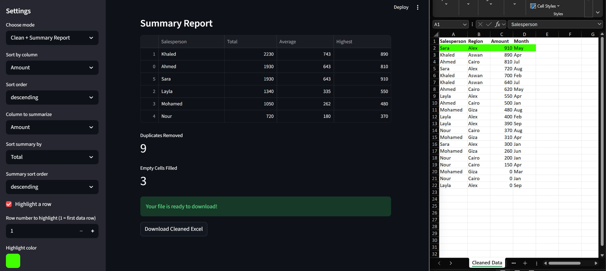

# Python Automation Portfolio

Python scripts and web tools for automating Excel, CSV, and web data tasks — cleaning, merging, analyzing, and reporting.

Drop a messy spreadsheet in. Get a clean, professional report out.

---

## 🚀 Live Demos

**Try the apps instantly — no installation needed:**

👉 [Data Cleaner Pro](https://mahmoud-data-cleaner.streamlit.app) — Upload messy CSV/Excel → get a clean formatted report

👉 [Web Scraper Pro](https://mahmoud-web-scraper.streamlit.app) — Enter a URL → scrape data → download as Excel

👉 [Multi-Page Scraper Pro](https://mahmoud-multi-scraper.streamlit.app) — Scrape multiple pages automatically → download as Excel

---

## Before & After


---

## App Screenshot



---

## What These Scripts Do

Every script here solves a real business problem: messy data comes in, clean results go out — automatically, without touching the original files.

---

## Tools & Scripts

### `data_cleaner_app.py` — Data Cleaner Pro (Live Web App)

A full web application that cleans messy CSV and Excel files through a browser — no Python knowledge required.

**🔗 Live demo: [mahmoud-data-cleaner.streamlit.app](https://mahmoud-data-cleaner.streamlit.app)**

**How to use:**
1. Upload one or multiple CSV or Excel files using the upload button
2. Choose your mode — Clean Only or Clean + Summary Report
3. Optionally sort the data by any column
4. In Summary mode, pick the numeric column to analyze — totals, averages, and highest values are calculated automatically
5. Optionally highlight any row with a custom color
6. Click Download to get your clean, formatted Excel file

**What it does:**
- Removes duplicate rows automatically
- Fixes text casing and strips extra spaces across all columns
- Fills empty numeric cells with 0 and empty text cells with N/A
- Generates a Summary sheet with groupby analysis when requested
- Applies bold headers to all sheets
- Highlights any row in any color the user chooses
- Outputs a multi-sheet formatted Excel file ready to deliver to clients

Built with Streamlit — runs in any browser, no Python knowledge needed.

---

### `scraper_app.py` — Web Scraper Pro (Live Web App)

A full web application that scrapes any website and delivers the data as a clean Excel report.

**🔗 Live demo: [mahmoud-web-scraper.streamlit.app](https://mahmoud-web-scraper.streamlit.app)**

**How to use:**
1. Enter any website URL in the sidebar
2. Choose Auto mode to detect tables automatically, or Manual mode to enter an HTML tag and CSS class
3. Optionally sort the data and generate a summary report
4. Click Download to get your scraped data as a formatted Excel file

**What it does:**
- Auto-detects HTML tables on any page
- Manual mode: scrape any element by tag and CSS class
- Cleans and formats all scraped data automatically
- Optional summary report with totals, averages, and highest values
- Applies bold headers and optional row highlighting
- Outputs a formatted Excel file ready to use

Built with Streamlit, requests, and BeautifulSoup.

---

### `multi_scraper_app.py` — Multi-Page Scraper Pro (Live Web App)

A full web application that scrapes multiple pages automatically using a URL pattern.

**🔗 Live demo: [mahmoud-multi-scraper.streamlit.app](https://mahmoud-multi-scraper.streamlit.app)**

**How to use:**
1. Enter a URL pattern using `{page}` where the page number goes (e.g. `https://example.com/page-{page}.html`)
2. Set the number of pages to scrape
3. Choose Auto or Manual scraping mode
4. Click Download to get all scraped data combined into one Excel file

**What it does:**
- Loops through multiple pages automatically
- Combines all pages into one clean dataset
- Auto-detects tables or scrapes by tag and CSS class
- Optional summary report and row highlighting
- Outputs a formatted multi-sheet Excel file

Built with Streamlit, requests, and BeautifulSoup.

---

### `sales_report_generator.py` — Multi-File Sales Report

Takes a folder of raw CSV sales files and outputs a single clean Excel report.

- Reads all CSV files in the folder automatically — no manual file selection
- Removes duplicates, fixes text casing, strips extra spaces, fills empty cells
- Calculates total sales, average sale, and highest sale per salesperson
- Highlights the top salesperson row in green
- Outputs `final_report.xlsx` with bold headers and frozen top row
- Never modifies the original CSV files

---

### `pandas_cleaner.py` — One-Command CSV Cleaner

Cleans any messy CSV file automatically.

- Removes duplicate rows
- Fixes inconsistent text casing and strips extra spaces across all text columns
- Fills empty cells with "N/A"
- Reports exactly how many duplicates were removed and how many empty cells were filled
- Saves cleaned output to Excel without touching the original file

---

### `pandas_report.py` — Multi-CSV Merge & Summary

Merges multiple CSV files and generates a grouped sales summary report.

- Reads and merges all CSV files in the folder automatically
- Validates data before analysis
- Calculates total, average, and highest sale per salesperson using groupby
- Sorts results by total sales, highlights top salesperson in green
- Outputs a professional Excel report with bold headers

---

### `price_tracker.py` — Full Site Scraper & Price Report

Scrapes product data across an entire site and outputs a price analysis report.

- Scrapes multiple pages automatically with respectful request delays
- Cleans and converts price data for analysis
- Sorts all products by price
- Outputs `price_report.xlsx` with bold headers and a Summary sheet: total items, average price, cheapest and most expensive item

---

### `cleaner.py` — Excel File Cleaner

Takes any messy Excel file and returns a clean version automatically.

- Removes duplicate rows
- Strips extra spaces from all text fields
- Fixes inconsistent text casing
- Fills empty cells with "N/A"
- Never overwrites the original file

---

### `merger.py` — Multi-File Excel Merger

Merges multiple Excel files from a folder into one master report.

- Automatically finds all `.xlsx` files in the folder
- Validates that each file has an "Amount" column before processing
- Dynamically detects column positions — works regardless of column order
- Sorts all rows by Amount, highest first
- Outputs `master_report.xlsx` with bold headers

---

### `fiverr_readiness_test.py` — Blind Delivery Test

Given an unseen messy Excel file with no instructions, cleaned and delivered a professional report in under 2 hours.

- Merged and deduplicated data automatically
- Cleaned text columns, handled numeric columns separately
- Generated groupby sales summary sorted by total
- Delivered professional Excel report with bold headers and highlighted top row

This script exists to demonstrate real delivery speed and quality under pressure — not just clean demo data.

---

## How to Run

**Install dependencies:**
```bash
pip install openpyxl pandas requests beautifulsoup4 streamlit
```

**Run the web apps locally:**
```bash
python -m streamlit run portfolio/data_cleaner_app.py
python -m streamlit run portfolio/scraper_app.py
python -m streamlit run portfolio/multi_scraper_app.py
```

**Or use the live versions — no installation needed:**

👉 [mahmoud-data-cleaner.streamlit.app](https://mahmoud-data-cleaner.streamlit.app)

👉 [mahmoud-web-scraper.streamlit.app](https://mahmoud-web-scraper.streamlit.app)

👉 [mahmoud-multi-scraper.streamlit.app](https://mahmoud-multi-scraper.streamlit.app)

**Run any script from its folder:**
```bash
python sales_report_generator.py
python pandas_report.py
python price_tracker.py
python cleaner.py
python merger.py
```

---

## Requirements

- Python 3.x
- openpyxl
- pandas
- requests
- beautifulsoup4
- streamlit

---

## About

I automate Excel and data workflows using Python — cleaning messy files, merging reports, and delivering professional output fast. Every script is documented, non-destructive, and built to handle real-world data, not just clean demos.

**Available for work on Fiverr → [fiverr.com/pymahmoud](https://www.fiverr.com/pymahmoud)**

**Live demos:**
- [mahmoud-data-cleaner.streamlit.app](https://mahmoud-data-cleaner.streamlit.app)
- [mahmoud-web-scraper.streamlit.app](https://mahmoud-web-scraper.streamlit.app)
- [mahmoud-multi-scraper.streamlit.app](https://mahmoud-multi-scraper.streamlit.app)