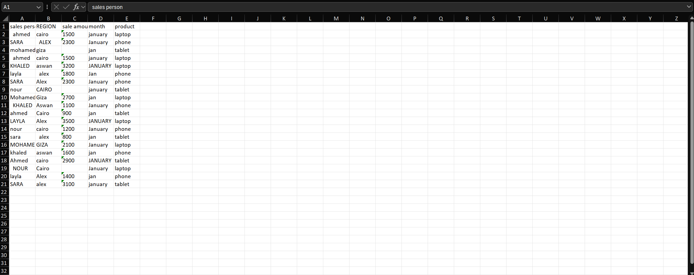
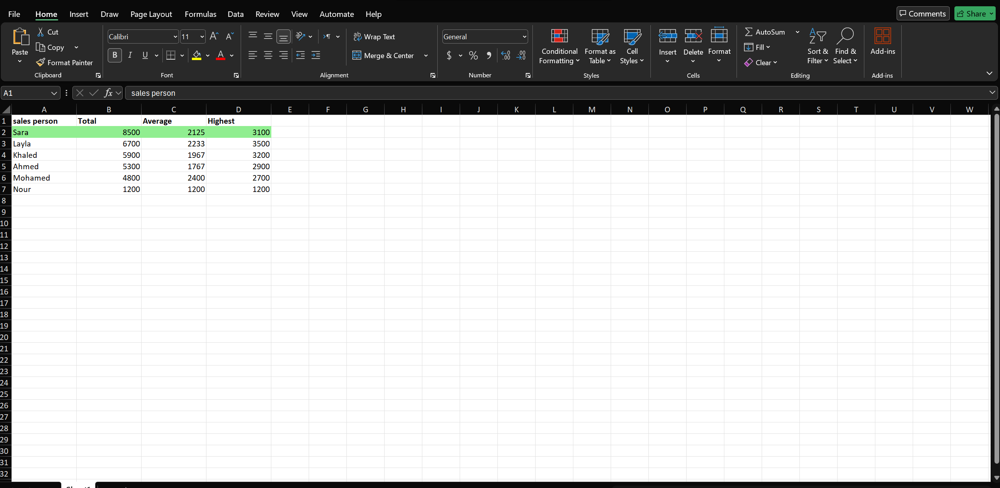

# Python Automation Portfolio

Python scripts for automating Excel, CSV, and web data tasks — cleaning, merging, analyzing, and reporting.

Drop a messy spreadsheet in. Get a clean, professional report out.

---

## Before & After




---

## What These Scripts Do

Every script here solves a real business problem: messy data comes in, clean results go out — automatically, without touching the original files.

---

## Scripts

### `sales_report_generator.py` — Multi-File Sales Report

Takes a folder of raw CSV sales files and outputs a single clean Excel report.

- Reads all CSV files in the folder automatically — no manual file selection
- Removes duplicates, fixes text casing, strips extra spaces, fills empty cells
- Calculates total sales, average sale, and highest sale per salesperson
- Highlights the top salesperson row in green
- Outputs `final_report.xlsx` with bold headers and frozen top row
- Never modifies the original CSV files

---

### `pandas_cleaner.py` — One-Command CSV Cleaner

Cleans any messy CSV file automatically.

- Removes duplicate rows
- Fixes inconsistent text casing and strips extra spaces across all text columns
- Fills empty cells with "N/A"
- Reports exactly how many duplicates were removed and how many empty cells were filled
- Saves cleaned output to Excel without touching the original file

---

### `pandas_report.py` — Multi-CSV Merge & Summary

Merges multiple CSV files and generates a grouped sales summary report.

- Reads and merges all CSV files in the folder automatically
- Validates data before analysis
- Calculates total, average, and highest sale per salesperson using groupby
- Sorts results by total sales, highlights top salesperson in green
- Outputs a professional Excel report with bold headers

---

### `price_tracker.py` — Full Site Scraper & Price Report

Scrapes product data across an entire site and outputs a price analysis report.

- Scrapes multiple pages automatically with respectful request delays
- Cleans and converts price data for analysis
- Sorts all products by price
- Outputs `price_report.xlsx` with bold headers and a Summary sheet: total items, average price, cheapest and most expensive item

---

### `cleaner.py` — Excel File Cleaner

Takes any messy Excel file and returns a clean version automatically.

- Removes duplicate rows
- Strips extra spaces from all text fields
- Fixes inconsistent text casing
- Fills empty cells with "N/A"
- Never overwrites the original file

---

### `merger.py` — Multi-File Excel Merger

Merges multiple Excel files from a folder into one master report.

- Automatically finds all `.xlsx` files in the folder
- Validates that each file has an "Amount" column before processing
- Dynamically detects column positions — works regardless of column order
- Sorts all rows by Amount, highest first
- Outputs `master_report.xlsx` with bold headers

---

### `fiverr_readiness_test.py` — Blind Delivery Test

Given an unseen messy Excel file with no instructions, cleaned and delivered a professional report in under 2 hours.

- Merged and deduplicated data automatically
- Cleaned text columns, handled numeric columns separately
- Generated groupby sales summary sorted by total
- Delivered professional Excel report with bold headers and highlighted top row

This script exists to demonstrate real delivery speed and quality under pressure — not just clean demo data.

---

## How to Run

**Install dependencies:**
```bash
pip install openpyxl pandas requests beautifulsoup4
```

**Run any script from its folder:**
```bash
python sales_report_generator.py
python pandas_report.py
python price_tracker.py
python cleaner.py
python merger.py
```

---

## Requirements

- Python 3.x
- openpyxl
- pandas
- requests
- beautifulsoup4

---

## About

I automate Excel and data workflows using Python — cleaning messy files, merging reports, and delivering professional output fast. Every script is documented, non-destructive, and built to handle real-world data, not just clean demos.

**Available for work on Fiverr → [fiverr.com/pymahmoud](https://www.fiverr.com/pymahmoud)**
